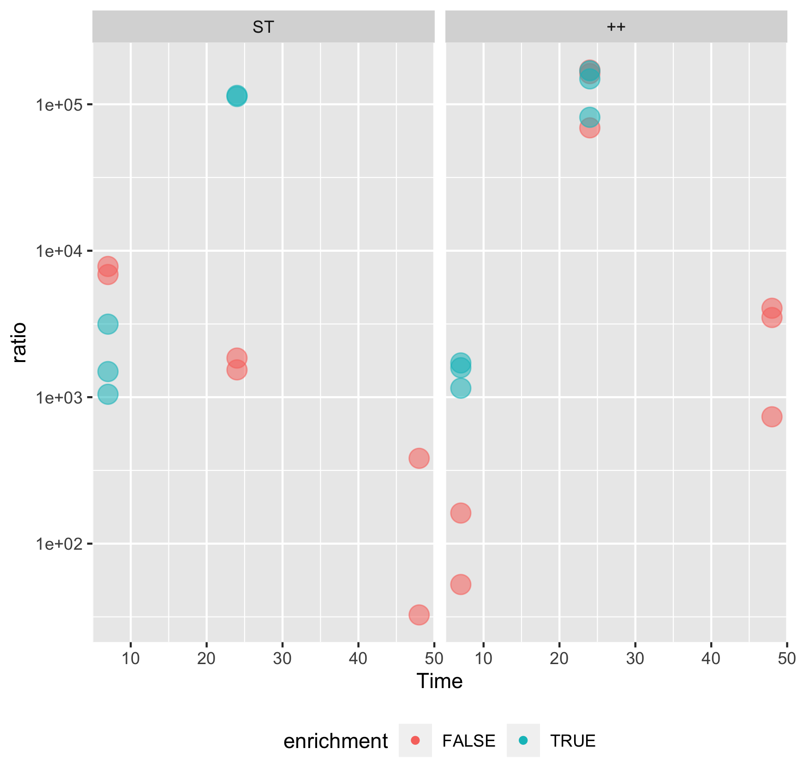

qPCR of Batch Fermentations
---------------------------

During Batch Fermentation 3 and 4, samples were taken in frequent order.
After 7 hours and 24 hours an enrichment step was carried out according
to the protocol. Goal of the enrichment step was to explore an overgrown
of receiver strains eventually. This would help to detect horizontal
gene transfer in the batch fermentation.

DNA extraction was carried out with the .FastDNAtm Spin kit
for soil. Quantification of gene copy numbers was evaluated through a
standard curve of the gene of interest, unique sequence for the strain
and antibiotic resistance gene sequence respectively, using the in house
program from the qPCR machine (Light Cycler 480)

Raw data was screened manually and checked for consistency and correct
melting temperature of the samples.

Technical replicates were pooled and sd was calculated (" in progress ")
the biological replicates were ploted against the time, variation is
indicated as a line. The plot which showing the change of concentration
of the antibiotic gene is placed next to the concentration of the unique
sequence sequence. the scales are fixed to compare change of the
concentration of both genes. The condition were either only spiked with
the strain of interest (ST) or with the strain and the antibiotics (++).

### E.faecium

> higher concentration for both genes in the condition with Antibiotic,
> seems that AB pressure has an positive impact on growth

### E.coli

The same workflow was used to generate similar plot in the Batch
fermentation 3, which the spiked strain was a *E.coli* strain, which is
carrying the bla operon, encoding for multiple ab resistances, mostly
against Glycopeptide.

 

Horizontal gene transfer (HGT)
------------------------------

To see (HGT) directly, the ratio of antibiotic gene over the unique
sequence should grow with time.

> Big numbers but, theres no big change in ratio . Same pattern in both
> batch fermentaion, below theres the ratio for e.coli

